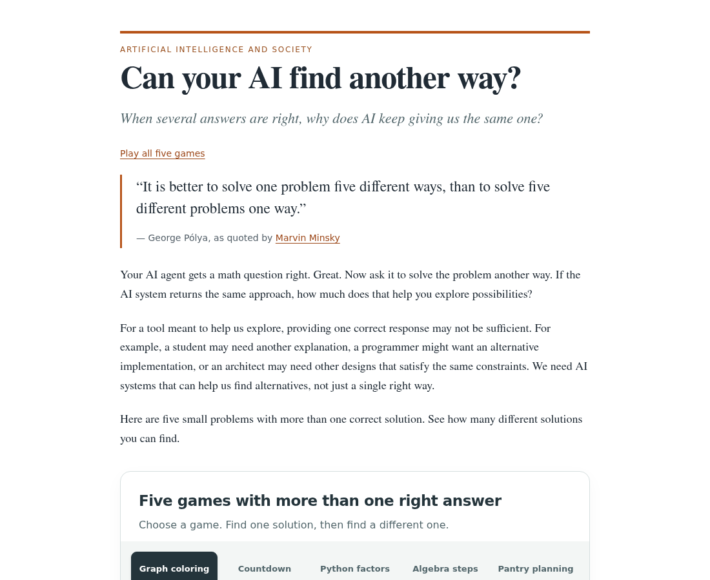

# Can your AI find another way?

An interactive blog post about mode collapse, with five playable games and an adjustable discovery graph.

View the full page: [desktop preview](preview/desktop.png) · [phone preview](preview/mobile.png). These are screenshots; use the Render deployment below to play the games and adjust the graph.

## Deploy on Render

[Deploy to Render](https://render.com/deploy?repo=https://github.com/liv-daliberti/maxent-grpo/tree/mode-collapse-blog)

The Blueprint deploys a static site from `public/`. There are no runtime dependencies or API keys. The build command checks the pages, local assets, and paper PDF. Automatic deployment is disabled; deploy the latest commit explicitly when updating the post.

Manual setup: select repository `liv-daliberti/maxent-grpo`, branch `mode-collapse-blog`, service type **Static Site**, build command `node scripts/check-site.mjs`, publish directory `public`.

## Preview

Run `python3 -m http.server 8000 --directory public`, then open http://localhost:8000.

The browser games and graph run entirely in the browser. `public/paper.pdf` is the accompanying paper. PNG and SVG figures are in `public/figures/`.
